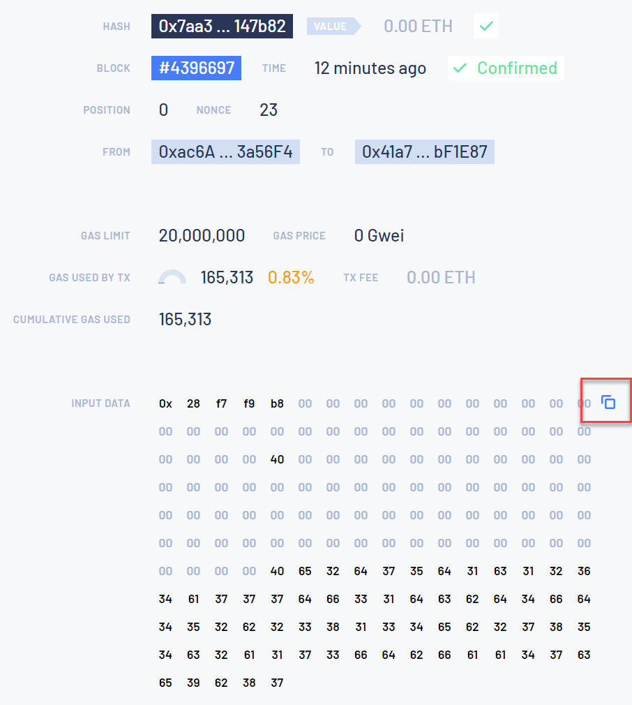
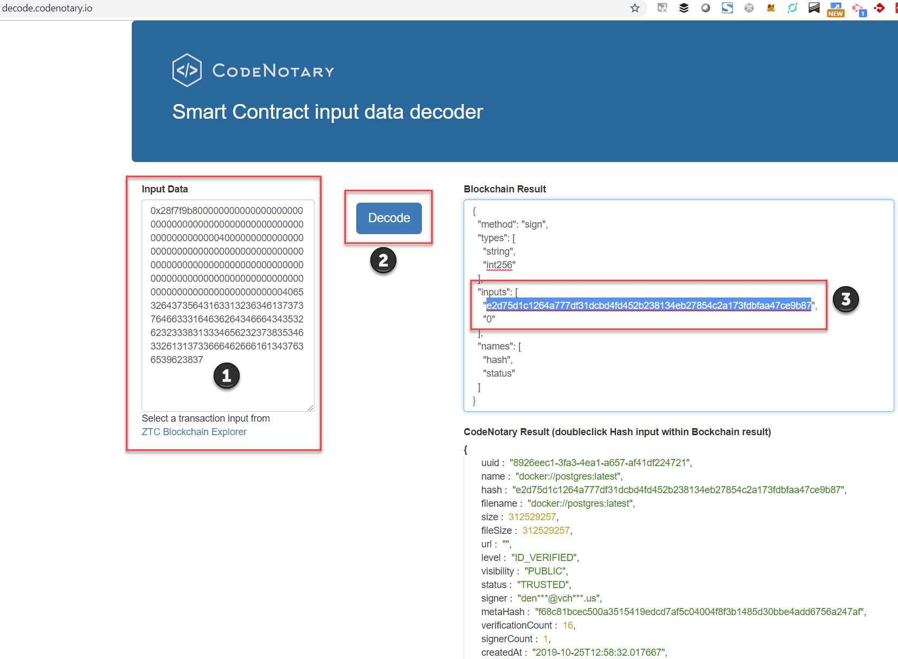

# My Assets

### What is an asset?
In CodeNotary terms, an asset is anything digital that is made up of 1’s and 0’s. Of course, the binary level is as base as it gets and there are scaled degrees of larger digital scaffolding of all sizes including snippets, images, containers, programs, apps, backups, etc. All assets can have their digital integrity authenticated anytime, anywhere. And CodeNotary’s dashboard makes it easy to manage all your assets in the same place.

## Verified counter
Displays the number of authentications (on your assets)

## Signed counter
Displays the number of assets signed by you

## Group Assets by Hash

You are able to easily visualize your asset versions by turning on the ‘Group by Asset’ feature for a cleaner dashboard experience. This will group all versions of the same asset together by matching their hashes together. The latest signed version will always be presented first. Clicking the down arrow icon to the left of the asset’s name will cause the asset timeline to display and open up an accordion view of the asset history as shown below.

## Search

Search in your assets by (file)name. Start to type the filename and the asset list will show the filtered results immediately.

## Asset details

Click on the little ‘i’ icon to the far right in the row of a specific asset, a detail page will pop up with all the asset’s details, including metadata and custom attributes.

## Export Assets

You can easily export the asset list into csv format. Click on the 'File - download' icon in the top right corner of the list and a csv file will start to download with every asset you see in your asset list.

## Asset fields - Columns

### Name

Filename or name of asset

### Authentications

Authentication counter

### Signed on

Date of signature

### Size

Size of the asset - displayed in Kb, Mb, Gb, etc.

### Visibility

Asset visibility - possible values are: Public / Private

### Conflicts
// TODO

### Publisher
// TODO

### Status

- **TRUSTED**  The asset was signed. - The signature on the blockchain indicates that the signer trusts that asset.
- **UNKNOWN**  The asset was not signed. -  There's no signature on the blockchain.
- **UNTRUSTED**  The asset is untrusted. - The signature on the blockchain indicates that the signer DOES NOT trust that asset.
- **UNSUPPORTED**  The asset is unsupported. - The signature on the blockchain indicates that the signer DOES NOT trust that asset because it is not supported anymore (eg. deprecated).

### Level

- Level -1  **DISABLED** - The signer's account is disabled.
- Level 0 **UNKNOWN** - The signer's identity is unknown.
- Level 1 **EMAIL_VERIFIED** - The signer's email is verified by CodeNotary platform.
- Level 2 **SOCIAL_VERIFIED** - The signer's identity is verified by social media profiles.
- Level 3 **ID_VERIFIED** - The signer provided an ID document.
- Level 4 **LOCATION_VERIFIED** - The signer provided a proof-of-address.
- Level 99 **VCHAIN** - *Reserved*

## Show and hide columns

To show and hide asset list columns click on the vertical dots icon at the end of the table's headline and select which columns you want to see. The dashboard application automatically saves these settings into your browser's localstorage.

## Howto check the Blockchain transaction

There might be situations where you want to know if and where the notarization transaction happened on the [ZTC blockchain](https://www.zerotrustconsortium.org).
In that case we got you covered, as you can click on the transaction details icon next to the notarized digital asset:

You'll be forwarded to the ZTC Blockchain explorer and the transaction you clicked on:

You can also copy the input data to your clipboard to convert it into human readable data.
Simply paste (1) the copied input data into [decode service of CodeNotary](https://decode.codenotary.io) and click decode (2) and select the hash value (3) to see even more details:

