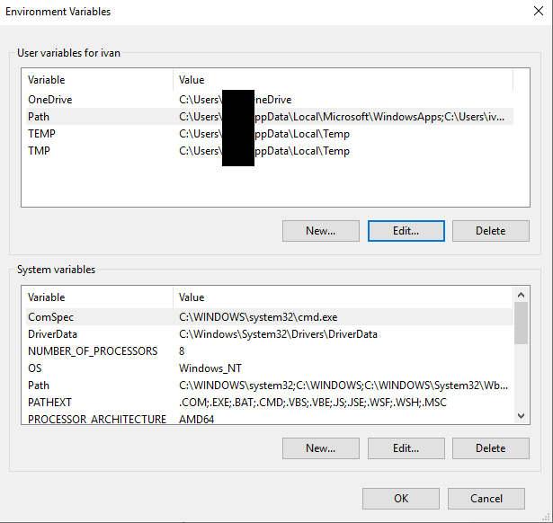
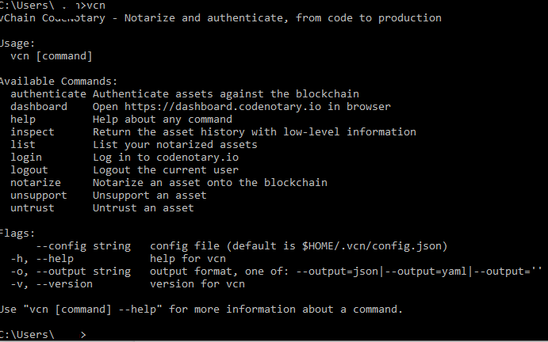
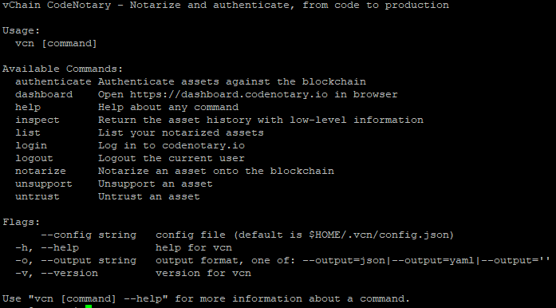
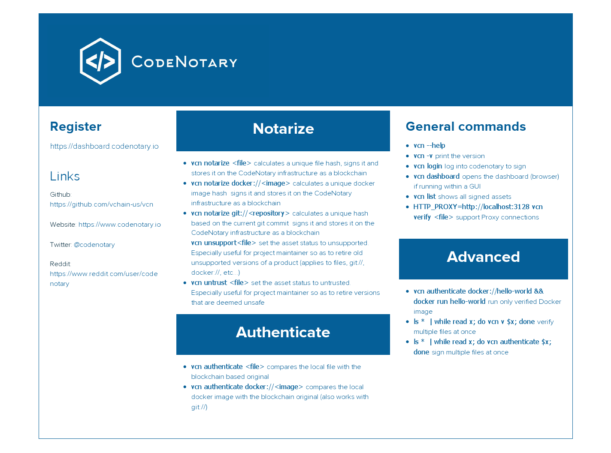

# Quickstart Help Guide

- [Quickstart Help Guide](#quickstart-help-guide)
  - [Open Source](#open-source)
  - [Registration](#registration)
  - [Installing the Codenotary tools](#installing-the-codenotary-tools)
    - [Install the Chrome Extension](#install-the-chrome-extension)
    - [Install the Codenotary plugin for Chrome](#install-the-codenotary-plugin-for-chrome)
  - [Install VCN for Windows](#install-vcn-for-windows)
    - [Integrating vcn in the windows PATH variable](#integrating-vcn-in-the-windows-path-variable)
  - [Download integrity check](#download-integrity-check)
  - [Install vcn CLI for Linux](#install-vcn-cli-for-linux)
  - [Running vcn](#running-vcn)
    - [Sanity checks](#sanity-checks)
    - [vcn authenticate (verify) vcn itself](#vcn-authenticate-verify-vcn-itself)
  - [vcn login](#vcn-login)
  - [vcn assets](#vcn-assets)
    - [vcn authenticate (any asset)](#vcn-authenticate-any-asset)
    - [vcn notarize/trust/untrust (any asset)](#vcn-notarizetrustuntrust-any-asset)
    - [vcn list](#vcn-list)
    - [vcn output format](#vcn-output-format)
  - [Access to source, opening issues and proposals for enhancements](#access-to-source-opening-issues-and-proposals-for-enhancements)
  - [Cheat sheet](#cheat-sheet)
  - [Resources](#resources)
  - [FAQ](#faq)

CodeNotary has the ambitious goal to become the standard for modern-age code signing. A true global, decentralized solution to enable secure source to production in your DevOps process in the simplest possible way.

This page explains how you can use the CodeNotary dashboard and vcn command line tool to notarize code, documents, and files (globally known as assets) using your CodeNotary account.

When code is notarized, a unique hash is created for the digital asset and signed with your unique identity. This guarantees that the file integrity is stored in a tamper-proof way. File integrity doesn’t judge the file content. What it does do however is ensure the asset has not been modified since it was notarized.

This quick help guide gives a brief explanation and ways to use the Codenotary command line (vcn) and how to notarize (sign) and authenticate (verify)

## Open Source

Codenotary is Open Source and the vcn command is published under GPL3 as Open Source, so that it can be reviewed for security and enhanced by the community as well as built by anyone. All code is written in Golang.

## Registration

Registering a Codenotary account is performed by visiting the [Codenotary dashboard](https://dashboard.codenotary.io) web site.


Assuming the email entered is not an existing account, clicking the register button registers the email as a new account.

The next page includes a brief presentation and a link to allow the confirmation email to be resent. The confirmation email contains a link that allows the email address to be confirmed and to continue the process.


Account profile information are given here (but can be changed later). Then the next button is used to go to the next step.


This page is shown for convenience and gives the option to download the command line utility vcn for the various supported operating systems. This page can also be accessed later from the dashboard toolbar and also at [Github](https://github.com/vchain-us/vcn/releases)

## Installing the Codenotary tools

### Install the Chrome Extension

This step, although optional, is highly recommended as it ensures that all subsequent downloads from Codenotary (and then also from other sources if the assets are notarized) using the Chrome browser are authenticated and genuine.

In the Chrome Webstore search for CodeNotary, install and enable the extension.

This procedure may slightly vary from one version of Chrome to another but is quite straightforward. All URLs should be allowed for the plugin to perform maximum verifications.

### Install the Codenotary plugin for Chrome

The prefered way is to head to the [Chrome extension store](https://chrome.google.com/webstore/category/extensions)
And then search for “codenotary” - a “vChain Codenotary” extention should show:


Add it to Chrome when prompted.


This extension does not make any modifications to any file. It just inspects downloads to determine if they are notarized, it will be indicated. It however needs to inspect file contents to create a hash.

So the following should be allowed in the extension option :


## Install VCN for Windows

Installing vcn for windows requires a 64 bit windows 10 or better system.
The vcn for windows tools have 2 versions. The first is a setup version which provides Windows file explorer integration.


There is also a standalone command line version. The setup version also optionally installs the vcn command line interface, and this is recommended. The vcn command line executable is identical between the setup version and the standalone version for any given release, so installing the two version is not required.

Besides the fact that the windows executable are signed using CA (Certificate Authority) based signatures for easier Windows integration, they are also notarized using the Codenotary product which allows, at any time, for the product development team to indicate that a specific binary or package is no longer trusted or supported - something the CA based signing system does not permit.

### Integrating vcn in the windows PATH variable

This is an optional step, but allows easier access to vcn from the command line. In Windows Explorer, right click on the icon that represents the machine and select

- Properties
- Click Advanced settings
- Click the environment variables



- Double click on the environment variable Path for the current user
- Add an entry named %PROGRAMFILES%\CodeNotary and click OK


The system PATH variable can also be changed in which case the vcn command will be available to all users on that system.

Subsequently opening a new Command (cmd) Window or Powershell window, typing the “vcn” command should yield a help message (this does not have or should not be an administrative shell).



## Download integrity check

We advise to verify the integrity of the vcn CLI download using either the CodeNotary Chrome extension, or by dragging and dropping the file on [https://authenticate.codenotary.io/i](https://authenticate.codenotary.io/).

The vcn Install for Windows has been signed by Digital Certificate release to vChain, Inc., the company behind CodeNotary. As we know, the digital certificate only certifies that the download was not altered, but provides no information on whether it is still trusted or if it has become obsolete, something that the Codenotary product can do.

When using Linux, we advise to verify the checksum of the downloaded file with the following command:

    sha256sum vcn-<version downloaded>-linux-amd64

The resulting checksum should be identical to the one found in the description at [Github](https://github.com/vchain-us/vcn/releases). Similar to the digital certificate for Windows, the checksum only ensures the file’s contents integrity, not it’s support status which is ensured using CodeNotary itself.

## Install vcn CLI for Linux

As for the Windows environment, once the vcn command line binary has been downloaded/installed it should be made available for general users. The simplest way to do this under a Linux operating system is to copy it and make it available under a well known path (for example : /usr/local/bin).

As root (logging in as root, using su or sudo or whatever is appropriate for the target environment) copy the downloaded file to /usr/local/bin/vcn and make it executable with :

    cp vcn-<version downloaded>-linux-amd64 /usr/local/bin/vcn
    chmod +x /usr/local/bin/vcn

## Running vcn

### Sanity checks

To ensure vcn is correctly installed, typing “vcn” should display :



Or something similar. The actual output may depend on the current version of the Codenotary CLI (vcn).

### vcn authenticate (verify) vcn itself

The first real sanity check is to ensure “vcn” is itself notarized.

This can be done by using Windows explorer (if on Windows and the explorer integration was installed) using the contextual menu or by using the command line interface directly.

The output should contain this line, or something similar as the date might be different.


As a reminder, authenticating (verifying) assets never requires to be logged in to Codenotary.

If the output doesn’t indicate \"TRUSTED\" then it is possible this binary was deemed unsupported or untrusted by the development team between the time it was downloaded and the time it was authenticated with Codenotary.

## vcn login

The next step is to establish a relationship between the Codenotary account created earlier and the machine that is running vcn.

This is accomplished using the “vcn login” command and will enable notarization (signing) of assets.


The login password is the one used during registration.

## vcn assets

Codenotary vcn can authenticate/notarize/inspect a wide range (and expanding) type of assets. This includes :

- A file by simply specifying the file name or file://\<file\>
- A docker image by specifying docker://\<image name or image ID\>
- A directory with dir://\<directory\>
- A git repository with git://\<local repository directory\> which addresses the current git commit

### vcn authenticate (any asset)

Authenticating (verifying) an asset is the same as was done previously and can be performed on any kind of supported asset. If the account to which this user is logged in notarized the target asset, this takes precedence.

### vcn notarize/trust/untrust (any asset)

This is the step where an account holder will indicate how the asset should be viewed to the outside world.

**NOTE : the contents of the asset itself is *NEVER* uploaded to Codenotary or sent anywhere and relies solely on a locally calculated SHA256 hash to ensure uniqueness of the asset, and it is only the hash that is being notarized/signed.**

By default (when not notarized) an asset will be seen as *UNKNOWN* because it was never notarized. For example, when authenticating a generated random file this is the expected results.

When an account holder that is signed in with vcn to Codenotary wants to notarize, untrust or un-support an asset the vcn command is also used :


This is a private notarization. It is also possible to specify the ```-p``` or ```--public``` flag to make it public. The difference between public and private notarization is the amount of metadata (file size, file name, dates, etc) that is visible.

However, whether it is public or private, the “trust” status is always visible. The ```notarize``` command can be substituted with the ```untrust``` (meaning the developer deems this file unsafe) and ```unsupport``` (meaning this file may no longer work or may yield unpredictable results).

### vcn list

An additional helpful tool is the possibility to get from the command line the list of assets that have been "notarized" (trusted, untrusted, unsupported) from the account to which vcn is logged in. This is the same information visible on the Codenotary dashboard under the “My Assets” section.

### vcn output format

The output of vcn (all commands) can also be formatted in JSON (Javascript Object Notation) or YAML (Yet Another Markup Language) format if needed for example for scripting or automation since the output will be consistent accross invocations.

## Access to source, opening issues and proposals for enhancements

The Codenotary Command line interface (CLI) is (c) vChain, Inc. but is open source Free Software under a GPLV3 license. The source code is available at [Github](https://github.com/vchain-us/vcn). Anyone is welcome to open issues or make pull requests with possible patches which will be reviewed.

## Cheat sheet

The following Cheat Sheet has been compiled to have a quick reference card at hand if needed. The full help is available [here](https://docs.codenotary.io).



## Resources

- [Codenotary site/dashboard](https://dashboard.codenotary.io)
- [Github repository](https://github.com/vchain-us/vcn) which also contains work in progress, the github issue/ticket system and more.

## FAQ

If you have any questions that haven’t been covered in our quick guide, please also check our [FAQ](http://www.codenotary.io/faq/) page.
