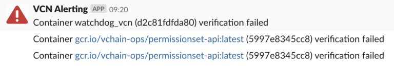

# Docker Integration for vcn


- [Docker Integration for vcn](#docker-integration-for-vcn)
- [Out-of-the-box integration](#out-of-the-box-integration)
  - [Sign a local Docker image](#sign-a-local-docker-image)
  - [Docker Sidecar Integration](#docker-sidecar-integration)

# Out-of-the-box integration

vcn supports local Docker installations out of the box using docker:// as a location. You just need to point to the correct container image name or the container image id.

## Sign a local Docker image

vcn uses Docker default schemes, so the latest tag is automatically used if no tag is given. For example:

```(sh)
vcn sign docker://hello-world
```

Or use the command with a tag:

```(sh)
vcn sign docker://hello-world:v1
```

*To be able to sign, you need to register at [CodeNotary](https://dashboard.codenotary.io/) for a free trial account.

## Docker Sidecar Integration

vcn also offers a sidecar project, you can use to automatically verify used container images during runtime.

Check out [https://github.com/vchain-us/vcn-watchdog](https://github.com/vchain-us/vcn-watchdog) on your server. The tool continuously verifies the integrity of your containers:

```(sh)
 git clone https://github.com/vchain-us/vcn-watchdog.git
 ```

Edit the verify file and set the alerting/monitoring tool you are using (see the following instructions), if you want to change the alerting

Make sure /var/run/docker.sock is accessible and run the following command on your server within the vcn-watchdog directory.

docker-compose build && docker-compose up  

To modify the verify file, hook up your alerting tool into the err() function.

Example using Slack, do the following:

Create a Slack Bot (Slack documentation here)
Use the following code:

```(sh)
function err() {
    echo "Container ${1} (${2}) verification failed" >&2
    curl -q -X POST \
        -H 'Content-type: application/json' \
        --data "{\"text\":\"Container ${1} (${2}) verification failed\"}" \
        "https://hooks.slack.com/services/$TOKEN/$KEY" > /dev/null 2>&1}
```

If all works well, you should receive slack messages in your slack channel
