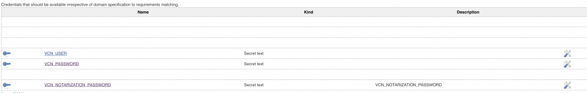
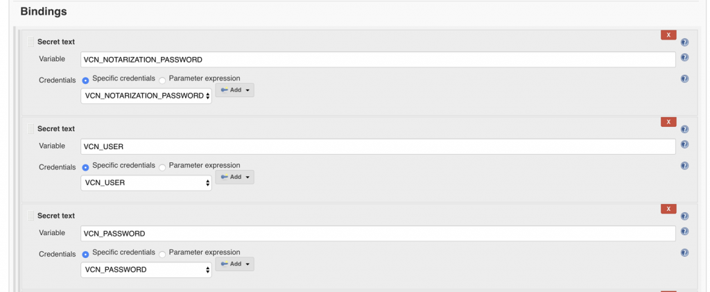

# Jenkins Integration for vcn


- [Jenkins Integration for vcn](#jenkins-integration-for-vcn)
  - [Steps](#steps)
    - [Step 1: System level configuration](#step-1-system-level-configuration)
      - [Step 1.1 : Select system credentials](#step-11--select-system-credentials)
      - [Step 1.2 : Add domain](#step-12--add-domain)
      - [Step 1.3 : Add credentials](#step-13--add-credentials)
    - [Step 2: Per build job](#step-2-per-build-job)
      - [Step 2.1 : Login and configure build job](#step-21--login-and-configure-build-job)
      - [Step 2.2 : Configure build step](#step-22--configure-build-step)
  - [Step 3: Before deployment](#step-3-before-deployment)

The integration has 3 main steps in what otherwise can be labeled a 10 step process. The 3 main steps are:

## Steps

1. System level configuration
    1. Configure vcn credentials system-wide in Jenkins
2. Per build job
    1. Tie `vcn` credentials in from system configuration to local environment variables
    2. Sign asset
3. Before deployment
    1. Run `vcn authenticate` with asset parameters

### Step 1: System level configuration

On the Home Screen, locate and click the Credentials link in the sidebar menu to expand the submenu beneath it.


#### Step 1.1 : Select system credentials

With the submenu opened up, go ahead and select the credentials type, in this case, select System.


#### Step 1.2 : Add domain

After selecting System, click Add Domain and notice the right-hand display shows ‘Global credentials (unrestricted)’. Click the link.


#### Step 1.3 : Add credentials

Create new credentials by selecting the Add Credentials option.


### Step 2: Per build job

Now that you have the credential creation display opened, you will need to create your credential entries for your `vcn` notarization password, `vcn` user account, and `vcn` password.


Once you have all 3, your list of credentials should look something similar to the below.



#### Step 2.1 : Login and configure build job

Next, you will need login and to configure the build job environment for each build job you have. This is relatively simple. All you need to do is to tie the vcn credentials in from the system configuration to the local environment variables by setting the appropriate bindings.



After successfully setting your bindings, you will need to add a build job build step for signing your code with the `vcn`

application. Click on the ‘Add build step’ drop down and select ‘Execute shell.’


#### Step 2.2 : Configure build step

Next, after vcn login and entering your credentials in the CLI, you will need to configure your build step for vcn signing by typing in:

```(sh)
vcn login
vcn notarize docker://gcr.io/vchain-ops/vcn:stable
```

in the Command field.


## Step 3: Before deployment

Lastly, you will need to execute this snippet in the deployment process:

```(sh)
vcn authenticate docker://gcr.io/vchain-ops/vcn:stable && your_deploy_script.sh
```

And that’s it. You’re now ready to have vChain CodeNotary provide a perpetually running integrity check into all of your Jenkins build deployment pipeline, as well as ensure you are participating in the latest DevSecOps best practices.

[Sign up for a free trial and test the Jenkins integration out for yourself.](https://dashboard.codenotary.io/auth/signup)
